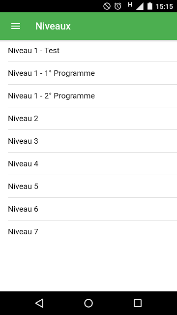
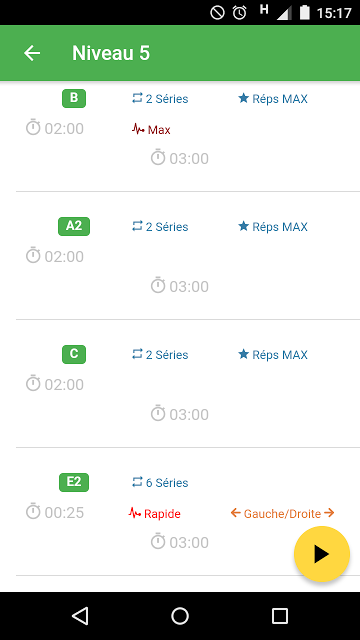
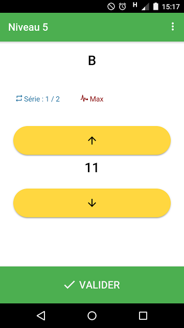
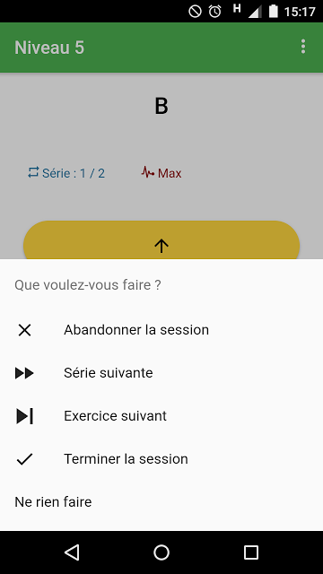

# Fitness App Example

This is a fitness sample application that one can use to track each session and save its results.

This application was released in production from August 09th 2017 to September 05th 2017 on Google Play Store.

From now, It's just a sample application that everyone (especially me) can consult further.

It's based on Angular 4, Ionic 3 and use @ngrx/store and @ngrx/effects.

